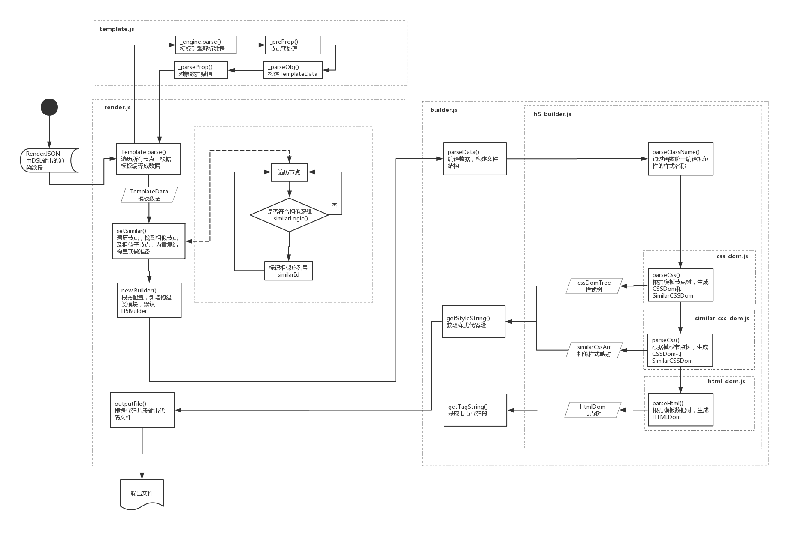

# Render & Template模块
## 概述
「Render & Template」模块主要用于对DSL生成的结构数据，通过模板引擎重组成渲染数据，并根据渲染样式的映射关系解析成输出数据。


### Template概述
根据RenderJSON提供的数据，在模板库中找到符合的模板，并结合数据节点解析出TemplateData

### Render概述
根据TemplateData结构，完成一下步骤

- 遍历节点，完成「相似节点」和「相似子节点」的标识
- 新建输出文件构建器`[Builder]`
- Builder根据配置编译TemplateData，并生成Style文件和Tag文件，在Html类型中，输出的为HTML文件和CSS文件


## 调用
```typescript
// 引用
const Render = require('server_modules/render/render.js');
// 构建渲染器
let render = Render.process(dslTree, Common.FlexLayout);
// 生成HTML 字符串
let htmlStr = render.getTagString();
// 生成CSS 字符串
let cssStr = render.getStyleString();
```
## 数据结构

### TemplateData
描述：通过模板引擎结合RenderJSON解析生成渲染模板树，用以衍生其他终端代码
### 属性
| 名称 | 类型 | 描述 |
| ------ | ------ | ------ |
parentId|ID|父节点ID
parent|Object`{TemplateData}`|父节点
serialId|String|节点序列号
tagName|String|标签名称
isClosedTag|boolean|是否闭合标签
id|ID|ID
tplAttr|Object|模板属性
similarParentId|ID|相似节点源序列
/* 以下属性来源于RenderData */|||
type|String`{RenderDataType}`|数据类型
modelName|String|模型名称
modelRef|Object`{RenderData.modelRef}`|模型引用
modelId|ID|模型ID
abX|Number|绝对定位X
abY|Number|绝对定位Y
abXops|Number|绝对对角定位X
abYops|Number|绝对对焦定位Y
canLeftFlex|Boolean|可左拉伸
canRightFlex|Boolean|可右拉伸
constraints|Object`{Constraints}`|约束描述
zIndex|Number|层级
text|String|文本
path|String|图片路径
styles|Object|样式
similarId|ID|相似节点序列
children|Array`<TemplateData>`|子节点

### HtmlDom
描述：用于构建Html结构树

#### 属性
| 名称 | 类型 | 描述 |
| ------ | ------ | ------ |
children|Array<HtmlDom>|子节点
parentNode|HtmlDom|父节点
id|ID|ID
serialID|Number|节点序列ID
similarId|ID|相似节点序列号
modelId|ID|模型ID
modelName|String|模型名称
tagName|String|标签名称
isClosedTag|Boolean|是否关闭标签
text|String|节点文本
abX|Number|绝对位置X
abY|Number|绝对位置Y
width|Number|宽
height|Number|高
path|String|图片路径
contrains|Object|约束
tplAttr|Object|模板属性
selfClassName|String|节点样式名
similarClassName|String|相似节点样式名

####方法
| 名字 | 参数 | 返回 | 描述 |
| ------ | ------ | ------ | ------ |
getAttrClass()|null|String|获取节点样式
getTag()|null|String|获取节点名称
getContent()|null|String|获取节点内容
getAttrs()|null|String|获取节点属性
getHtmlStart()|_layoutType`{LayoutType}`:布局模式|String|获取初始节点
getHtmlEnd()|null|String|获取闭合节点


### CssDom

描述：用于构建CSS结构树

#### 属性

| 名称 | 类型 | 描述 |
| ------ | ------ | ------ |
id|ID|ID
tagName|String|标签名
serialId|Number|节点序列号
modelId|ID|模型ID
modelName|String|模型名称
type|String`{RenderDataType}`|RenderData类型
canLeftFlex|Boolean|可左伸展
canRightFlex|Boolean|可右伸展
isCalculate|Boolean|已完成约束计算
tplAttr|Object|节点属性对象
similarId|ID|相似节点序列号
parent|CssDom|父节点
layoutType|String`{LayoutType}`|布局类型
_abX|Number|绝对位置X
_abY|Number|绝对位置Y
_abXops|Number|绝对位置对角X
_abYops|Number|绝对位置对角Y
_width|Number|宽度
_height|Number|高度
_zIndex|Number|层级
_hasText|boolean|是否有文本
constraints|Object`{Constraints}`|约束描述
path|String|图片路径
styles|Object|样式
children|Array`<CssDom>`|子节点
selfCssName|String|节点样式名
similarCssName|String|相似节点样式名
|/* 以下为驼峰命名的样式属性 */|||
color|CSS|color|
....|...|...
zIndex|CSS|z-index|

#### 方法

| 名字 | 参数 | 返回 | 描述 |
| ------ | ------ | ------ | ------ |
getCss()|null|String|获取样式片段
getClass()|null|String|获取样式名
getCssProperty(similarCss)| similarCss`{SimilarCss}`|Array|获取Css属性组
/* 以下为静态方法 */||||
`static` getLinearGradient(bgColor, width, height)|bgColor`{Color}`:背景色值<br>width`{Number}`:节点宽度<br>height`{Number}`:节点高度|String`{CssValue}`|获取线性渐变值
`static` getRGBA(color)|color`{Color}`:颜色值|String|获取RGBA
`static` getRadius(vals,maxSize = 100)|vals`Array<Number>`:圆角数组<br>maxSize`{Number}`:圆角Ï最大值|String|获取圆角值
`static` borderType(style)|style`{Style}`:样式对象|String|获取边框类型
`static` transUnit(number, unit = "rem")|number`{Number}`:数值<br>unit`rem|px`:数值单位|String|属性值单位转换
