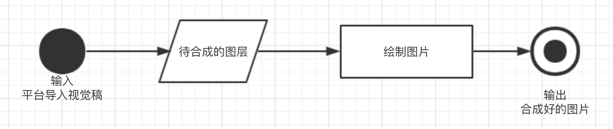

# DesignImage
## 概述
DesignImage模块主要是将合并成一张图片的图层，通过程序把图片绘制合成出来。


## 算法思想
- 1.将没经过结构调整的节点使用绘图库绘制成临时图片
- 2.对结构中有改动的组元素节点进行递归合图处理
- 3.对于有遮罩的节点，先将被遮罩层组合成一个整体图片，遮罩层单独生成，然后对两者进行与运算。
- 4.最后对所有已合成或普通节点按层级做叠加处理。


## 术语
- <strong>图层</strong> 视觉稿节点

## 调用方式
### 1. 引用
```typescript
let ImageCombine = require("../../server_modules/designimage/img_combine").ImageCombine;
```
### 2. 创建对象与初始化
```typescript
/**
 * 初始化
 * @param {Object} imageCombineConfig 
 * imageCombineConfig.projectName : 要处理的设计稿的名字
 * imageCombineConfig.outputDir : 图片输出目录
 * imageCombineConfig.generateId : 生成图片ID
 * imageCombineConfig.inputDir ：解压后的源文件目录（可选）
 * imageCombineConfig.binDir : 绘图库的路径（可选）
 * imageCombineConfig.pageJson : 所有要合成的图片的数据json（可选）
 * imageCombineConfig.sketchDir : 设计稿所在目录（可选）
 */
let imageCombine = new ImageCombine();
imageCombineConfig = {
    inputDir: "./data/unzip_file/" + projectName + "/", 
    outputDir: "./data/complie/" + projectName + "/images/", 
    pageJson: imageList,
    projectName: projectName + ".sketch",
    generateId: "img" + i
};
imageCombine.init(imageCombineConfig);
```
### 3.合成图片
```typescript
/**
 * 将节点及其子节点合并成一张图片
 * @param {QObject} node
 * @param {Object} param
 * param.width 设置要合成的图片宽度
 * param.height 设置要合成的图片高度
 * param.cantNative 设置是否不能用绘图库
 * param.masked 标记该节点是被遮罩的
 * @returns {QNode} newNode 合成后的节点数据
 */
imageCombine.combineNode(node,param);
```

## 数据结构说明

#### 方法
| 名字 | 参数 | 返回 | 描述 |
| ------ | ------ | ------ | ------ |
| init(imageCombineConfig) | imageCombineConfig: `Object` | `Void` | 初始化入参 |
| combineNode(node,param) | node: `QObject` param: 可选，`Object`| `Object` | 绘图合成处理 |

#### 各方法详述

### imageCombine.init(imageCombineConfig)
#### 描述：初始化入参
#### 参数
##### imageCombineConfig属性
| 名字 | 类型 | 描述 |
| ------ | ------ | ------ |
| projectName | String | 要处理的设计稿的名字 |
| outputDir | String | 图片输出目录 |
| generateId | String | 生成图片ID |
| inputDir | String | 解压后的源文件目录（可选） |
| binDir | String | 绘图库的路径（可选） |
| pageJson | Json | 所有要合成的图片的数据json（可选） |
| sketchDir | String | 设计稿所在目录（可选） |

#### 返回 
Void

### imageCombine.combineNode(node,param)
#### 描述：绘图合成处理
#### 参数
##### node：`QObject`
##### param：`QObject`（可选）
| 名字 | 类型 | 描述 |
| ------ | ------ | ------ |
| width | Number | 设置要合成的图片宽度 |
| height | Number | 设置要合成的图片高度 |
| cantNative | Boolean | 设置是否不能用绘图库 |
| masked | Boolean | 标记该节点是被遮罩的 |
#### 返回 
Object 
| 名字 | 类型 | 描述 |
| ------ | ------ | ------ |
| _class | String | 固定combineImg，表示这是一个合并出来的节点 |
| x | Number | 图片坐标X |
| y | Number | 图片坐标Y |
| width | Number | 图片宽度 |
| height | Number | 图片高度 |
| path | String | 图片所在路径 |
