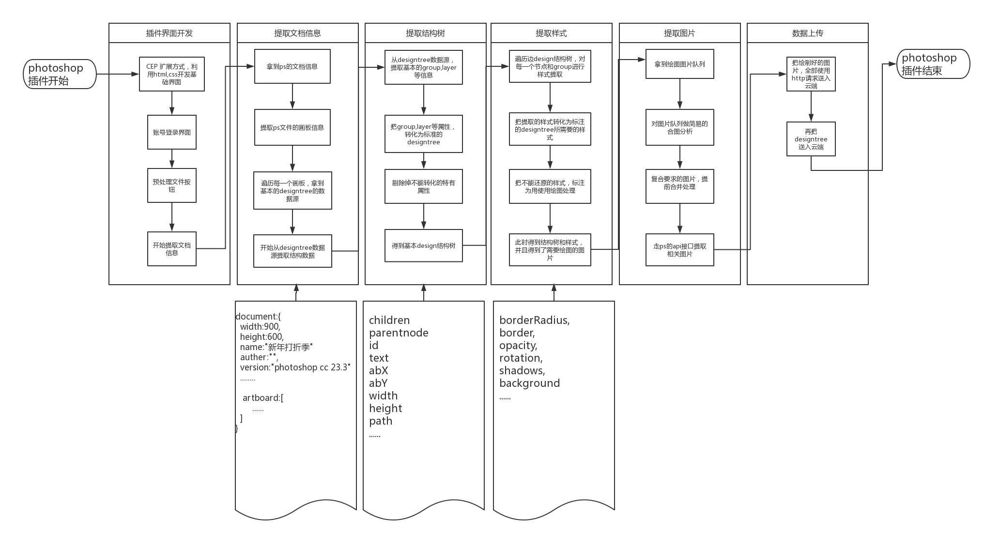

# 设计编译-PS插件API

## 概述
插件的作用是获取ps文档中的结构树、样式、图片等资源。并对原始资源进行初步预处理，如：mask层合并、调整层合并、智能对象合并、删除空白group、layer等等。之后得到一个由Qdocument、Qartboard、QText、QImage、QShape等组成的json结构树和图片集，再把所有资源一并提交服务器进行设计编译处理，最后返回一个网页链接，展示文档包含的所有页面。

## 用户系统
插件支持用户登录使用，登录后的用户，数据将会持久存储在后台服务中。

## 插件流程图
以下为photoshop的插件工作流程图：

## Qdocument

| 名字 | 类型 | 描述 |
| ------ | ------ | ------ |
| id | String | document id |
| name | String | document 名称 |
| type | String | document类型 |
| width | Number | document宽度 |
| height | Number | document高度 |

## Qartboard

| 名字 | 类型 | 描述 |
| ------ | ------ | ------ |
| id | String | artboard id |
| name | String | artboard 名称 |
| type | String | artboard 类型 |
| width | Number | artboard 宽度 |
| height | Number | artboard 高度 |

### QObject

描述：QObject是描述图层的抽象类，根据图层类型可分为`QShape`,`QImage`,`QText`,`QLayer`

#### 属性
| 名字 | 类型 | 描述 |
| ------ | ------ | ------ |
| id | String | 图元id |
| name | String | 图元名称 |
| type | String | 图元类型 |
| abX | Number | 图元水平绝对坐标X |
| abY | Number | 图元垂直绝对坐标Y |
| width | Number | 图元宽度 |
| height | Number | 图元高度 |
| parent | QObject | 图元父节点 |
| children | Array\<QObject> | 图元子节点数组 |
| styles | Object | 图元样式 |

#### 方法

| 名字 | 参数 | 返回 | 描述 |
| ------ | ------ | ------ | ------ |
| add(node) | node: `QObject` | `void` | 添加子节点
| remove(node) | node: `QObject` | `void` | 删除子节点 |
| getNodeById(id) | id: `String` | `QObject `| 通过id获取图元 |
| getNodeByName(name) | name: `String` | `QObject` | 通过name获取图元 |
| toList() | 无 | `Array<QObject>` | 获取图元集合 |
| getImage() | 无 | `Array<QObject>` | 获取图片图元集合 |

### QObject.styles

描述：图元样式
#### 属性
| 名字 | 类型 | 描述 |
| ------ | ------ | ------ |
| background | Object | 图元背景 |
| border | Object | 图元边框 |
| borderRadius | Array | 图元圆角 |
| shadow | Array | 图元阴影 |
| opacity | Number | 图元透明度 |

## QText
描述：文本图元
#### 属性
| 名字 | 类型 | 描述 |
| ------ | ------ | ------ |
| text | String | 文本内容 |

### QText.styles
描述：文本图元样式
#### 属性
| 名字 | 类型 | 描述 |
| ------ | ------ | ------ |
| texts | Array | 文本样式 |

#### QText.styles.texts

#### 属性
| 名字 | 类型 | 描述 |
| ------ | ------ | ------ |
| color | Object | 文字颜色 |
| string | String | 文字内容 |
| font | String | 字体 |
| size | Number | 文字大小 |

## QImage
描述：图片图元
#### 属性
| 名字 | 类型 | 描述 |
| ------ | ------ | ------ |
| path | String | 图片名字 |

## QShape
描述：图形图元，对矩形、圆形、路径等图形图层进行抽象。
#### 属性
| 名字 | 类型 | 描述 |
| ------ | ------ | ------ |
| shapeType | String | 形状类型 |
