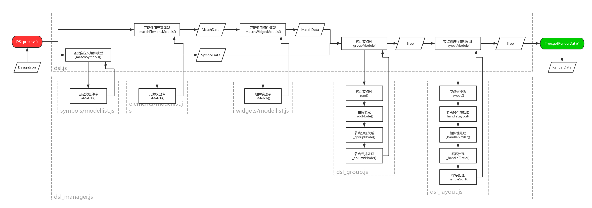
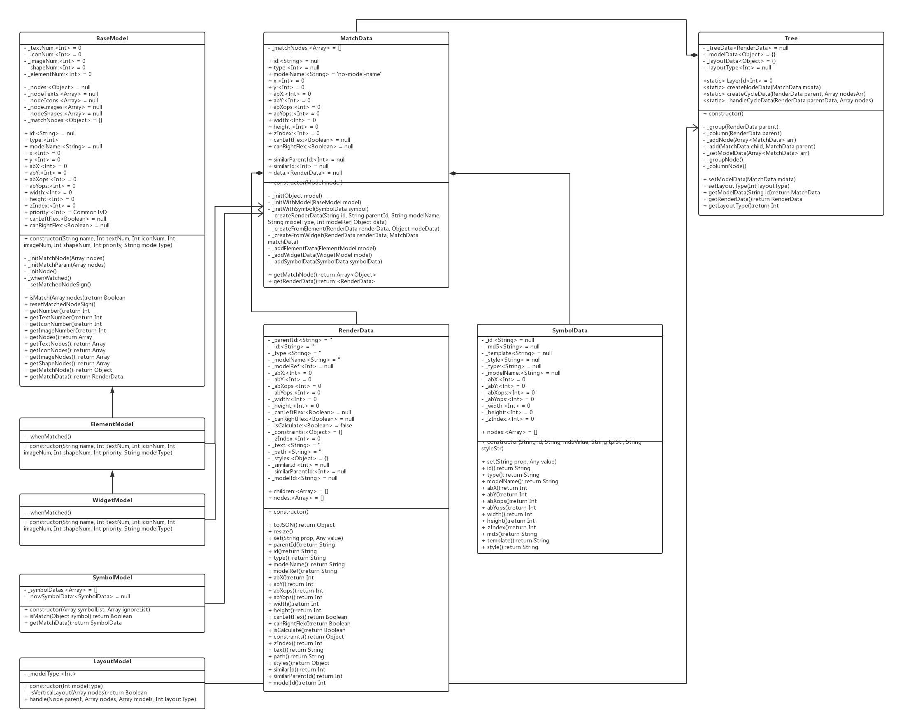

# DSL
## 概述
DSL模块是对DesignJson模块生成的节点数据进行处理的模块。主要由三个算法块组成：
1. 元素模型、组件模型的识别及组合匹配算法块（识别及匹配出模型）。
2. 模型数据进行组装结构化算法块（模型数据组成DSL树）。
3. DSL树进行布局处理及循环分析算法块（DSL树布局分析）。

## 调用方式

## 流程图

## UML图

## 数据结构
### MatchData
MatchData是匹配的元素模型及组件模型的结构化数据储存类。

#### 属性
| 名字 | 类型 | 描述 |
| ------ | ------ | ------ |
| id | String | id标识 |
| type | String | 模型类别 |
| modelName | String | 模型名称 |
| x | Number | 设计稿元素坐标X |
| y | Number | 设计稿元素坐标Y |
| abX | Number | 基于左上角原点的坐标X |
| abY | Number | 基于左上角原点的坐标Y |
| abXops | Number | 基于左上角原点的自身右下角坐标X |
| abYops | Number | 基于左上角原点的自身右下角坐标Y |
| width | Number | 模型宽度 |
| height | Number | 模型高度 |
| canLeftFlex | Boolean | 模型在空间上是否可以往左拓展 |
| canRightFlex | Boolean | 模型在空间上是否可以往右拓展 |
| zIndex | Number | 模型的层级 |
| similarParentId | String | 父节点的相似标识 |
| similarId | String | 相似标识 |
| data | RenderData | RenderData数据 |

#### 方法
| 名字 | 参数 | 返回 | 描述 |
| ------ | ------ | ------ | ------ |
| getMatchNode() | 无 | `Array<QObject>` | 获取匹配了的节点数组 |
| getRenderData() | 无 | `RenderData` | 获取MatchData生成的RenderData |

### RenderData
DSL模块数据储存结构类, 渲染信息的记录及返回。

#### 属性
| 名字 | 类型 | 描述 |
| ------ | ------ | ------ |
| parentId | String | 父节点id标识 |
| id | String | id标识 |
| type | String | 模型类别 |
| modelName | String | 模型名称 |
| modelRef | String | 对应模板中的节点标识 |
| abX | Number | 基于左上角原点的坐标X |
| abY | Number | 基于左上角原点的坐标Y |
| abXops | Number | 基于左上角原点的自身右下角坐标X |
| abYops | Number | 基于左上角原点的自身右下角坐标Y |
| width | Number | 模型宽度 |
| height | Number | 模型高度 |
| canLeftFlex | Boolean | 模型在空间上是否可以往左拓展 |
| canRightFlex | Boolean | 模型在空间上是否可以往右拓展 |
| isCalculate | Boolean | 该节点数据是否完成了布局计算 |
| constraints | Object | 该节点约束数据的记录 |
| zIndex | Number | 模型的层级 |
| text | String | 节点的文字储存 |
| path | String | 节点的图片路径储存 |
| styles | Object | 节点的样式数据储存 |
| similarParentId | String | 父节点的相似标识 |
| similarId | String | 相似标识 |
| modelId | String | 生成该RenderData数据的模型的id |
| children | `Array<RenderData>` | 子节点储存 |
| nodes | `Object<key, RenderData>` | 子节点储存, 但这里以key-value形式储存 | 

#### 方法
| 名字 | 参数 | 返回 | 描述 |
| ------ | ------ | ------ | ------ |
| toJSON() | 无 | Json | 返回一个Json数据结构 |
| resize() | 无 | `void` | 根据子节点重新计算自身坐标及尺寸 |

### Tree
#### 方法
| 名字 | 参数 | 返回 | 描述 |
| ------ | ------ | ------ | ------ |
| setModelData(mdata) | mdata: MatchData | `void` | 添加一个模型数据记录 |
| setLayoutType(layoutType) | layoutType: 布局方式 | `void` | 设置布局方式 |
| getModelData(id) | id: 模型id标识 | `MatchData` | 通过id标识获取模型数据 |
| getRenderData() | 无 | `RenderData` | 获取DSL处理后Tree所生成的用于渲染的全部数据 |
| getLayoutType() | 无 | `String` | 获取树的布局方式 |

## 使用接口
### dsl.js
dsl.js为DSL模块逻辑流程组织的模块
#### 方法
| 名字 | 参数 | 返回 | 描述 |
| ------ | ------ | ------ | ------ |
| process(nodes, optimizeWidth, optimizeHeight, layoutType) | nodes: 要匹配的所有节点; optimizeWidth: 匹配优化的范围取值宽度; optimizeHeight: 匹配优化的范围取值高度; layoutType: 布局的方式 | `Tree` | 返回Tree数据结构 |

### dsl_manager.js
dsl_manager.js主要为dsl.js的流程的组织提供各种算法块能力接口
#### 方法
| 名字 | 参数 | 返回 | 描述 |
| ------ | ------ | ------ | ------ |
| matchModel(nodes, matchType, endY) | nodes: 需要匹配的节点; matchType: 匹配模型的类型; endY: 当前匹配结束时范围取值的下边界 | `Array<MatchData>` | 返回匹配了数据 |
| groupModel(elementModels, widgetModels) | elementModels: 要成组的元素模型; widgetModels: 要成组的组件模型 | `Tree` | 对匹配好的模型做成组处理 |
| layoutModel(dslTree, layoutType) | dslTree: 需要进行布局关系处理的模型; layoutType: 处理布局的方式; | `void` | 对匹配好的组件/元素模型之间进行布局关系的分析处理 |

