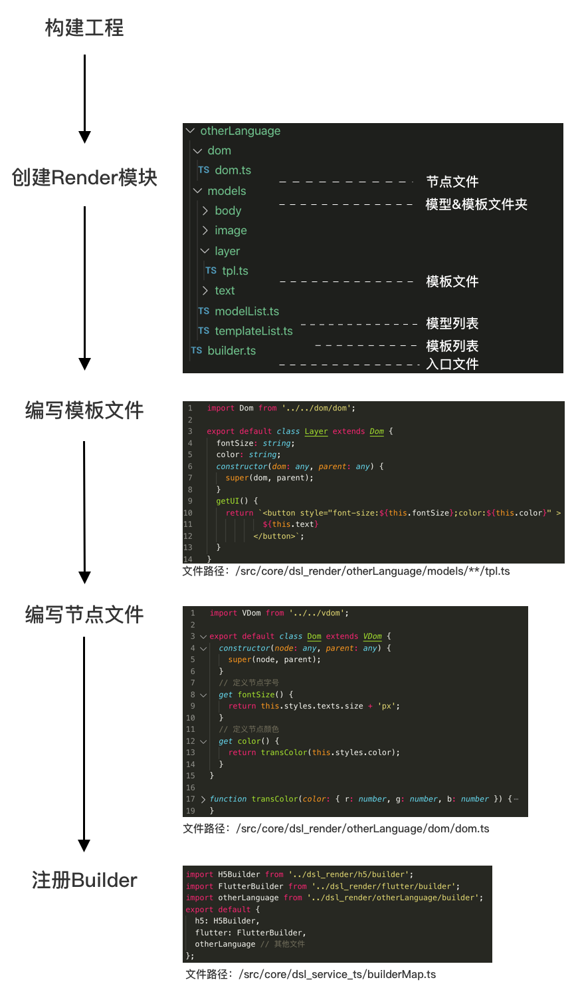

# 可自定义的目标语言渲染器

## 概述

Render 模块负责对 DSL 中生成的布局结构型数据进行编译渲染，该模块允许自定义其他目标语言的转换。


## 如何快速构建 Render

Render 模块主要通过`VDom`和`tpl`实现目标语言的转换：`VDom`提供了各模型模板所须的节点信息和函数方法；`tpl`继承`VDom`，根据模型特点实现具体的代码。
#### 如需要帮助请联系：chironyang



#### 步骤一 创建模块文件

创建在`src/core/dsl_render`中创建 Render 模块，文件结构如下

```
|-- dsl_render
    |-- builder.ts            // Render入口
    |-- dom
    |   |-- dom.ts            // 模板数据节点，继承自 VDom
    |-- models
    |   |-- modelList.ts      // 模型列表，默认须含 body,image,layer,text四种基础模型
    |   |-- templateList.ts   // 模板列表，默认须含 body,image,layer,text四种基础模板
    |   |-- body
    |   |   |-- tpl.ts        // 根节点模型模板
    |   |-- image
    |   |   |-- tpl.ts        // 图片模型模板
    |   |-- layer
    |   |   |-- tpl.ts        // 容器模型模板
    |   |-- text
    |       |-- tpl.ts        // 文本模型模板
    |   ...
    |   |-- /* modelName */
    |       |-- model.ts      // 其他模型
    |       |-- tpl.ts        // 模板
```

#### 步骤二 编写模板

`/Render/models/`下默认有`Body`、`Image`、`Layer`、`Text`四类模型对应的模板文件，模板均继承自`VDom`，模板内能读取节点信息，并通过拼接代码段和节点信息，构建成完整输出代码。
如在`/Render/models/body/tpl.ts`中，编写模型 body 需输出的代码片段。

```ts
// file path: /models/layer/tpl.ts
// 引入模板数据节点
import Dom from '../../dom/dom';
export default class Layer extends Dom {
  constructor(dom: any, parent: any) {
    super(dom, parent);
  }
  // 返回编译后的代码片段
  getUI() {
    // this.slot 会遍历子节点的模板内容，建议在有子节点的模板中都加入该属性
    return `<div class="${this.size}">
      ${this.slot}
    </div>`;
  }
}
```

#### 步骤三 在 Dom 中补充目标语言的属性

```ts
// file path: /dom/dom.ts
// 引入通用模型节点基类
import VDom from '../../vdom';

export default class Dom extends VDom {
  constructor(node: any, parent: any) {
    super(node, parent);
  }
  // 在这里定义目标语言的模板属性，并在模板中调用
  get size() {
    return /* ... */;
  }
}
```

#### 步骤四 构建 Builder

builder 作为 Render 获取模板数据的入口，在构建时可以获得来自 DSL 提供的：`data`含布局结构的数据树，`options`主流程信息，在 builder 初始化后，可以通过`this.dom`获取

```ts
// file path: /builder.ts
class builder extends Builder {
  // 构建Builder
  constructor(data: any, options: any) {
    /**
     * data: DSL返回的布局结构数据树
     * options: 主流程返回的全局参数
     * TemplateList: 当前构建器Builder所需要的模板列表
     */
    super(data, options, TemplateList);
  }

  // Render主流程获取编译结果的接口
  getResult() {
    let code = this.dom.getUI();
    return {
      main: code,
    };
  }
}
// Builder静态属性，为DSL提供【模型匹配】列表
builder.modelList = ModelList;
// Builder静态属性，为DSL提供【组件匹配】列表
builder.widgetList = [];

export default builder;
```

#### 步骤五 注册 Builder

在主程序`src/core/dsl_service_ts/builderMap.ts`中注册 Builder

```ts
// 引入builder
import H5Builder from '../dsl_render/h5/builder';
export default {
  h5: H5Builder,
};
```

#### 步骤六 平台调用接口测试

```ts
getTemplate(designJSON,{
    ...
    outputType: 'h5', // 在此传注册的builder名
    ...
  }
})
```

## VDom

在 Render 模块中，VDom 为每个模板提供对应节点数据属性，其包含了来自于 DSL 的属性，也包含自身特性计算的属性。在编写模板时，所需应用的属性值，都应继承于此类，继承关系如下

```ts
class Dom extends VDom{
  // 目标语言节点继承自 VDom
  ...
}

class ModelTemplate extends Dom{
  // 目标语言模板继承自 Dom
  ...
}
```

### VDom 的属性&函数

| 名字                                   | 类型                 | 描述                                          |
| -------------------------------------- | -------------------- | --------------------------------------------- |
| children                               | VDom[]               | 子节点                                        |
| parent                                 | VDom                 | 父节点                                        |
| id                                     | String               | ID                                            |
| type                                   | String               | 节点类型 ['QBody','QLayer','QImage','QText']  |
| serialId                               | String               | 序列号                                        |
| similarId                              | String \| Null       | 相似编组号                                    |
| canLeftFlex                            | Boolean \| Null      | 能否左拓展（可能废弃）                        |
| canRightFlex                           | Boolean \| Null      | 能否右拓展（可能废弃）                        |
| modelId                                | String               | 模型 ID                                       |
| modelName                              | String               | 模型名称                                      |
| text                                   | String \| Null       | 节点文本内容                                  |
| abX                                    | Number               | 节点`左上角`相对根节点坐标 X                  |
| abY                                    | Number               | 节点`左上角`相对根节点坐标 Y                  |
| abXops                                 | Number               | 节点`右下角`相对根节点坐标 X                  |
| abYops                                 | Number               | 节点`右下角`相对根节点坐标 Y                  |
| path                                   | String \| Null       | 节点图片路径                                  |
| constraints                            | Constraints          | 节点约束属性                                  |
| zindex                                 | Number`{0+}`         | 节点层级，zindex 越大层级越高                 |
| isMultiline                            | Boolean              | 是否多行文本                                  |
| styles                                 | Style                | 样式对象                                      |
| \|-- styles.background                 | Object \| Null       | 背景色                                        |
| \|-- \|-- styles.background.type       | String               | 背景类型,`color`纯色,`linear`线性渐变         |
| \|-- \|-- styles.background.color      | RGB                  | 颜色，type 为`color`是生效                    |
| \|-- \|-- styles.background.color.r    | String               | 颜色 R                                        |
| \|-- \|-- styles.background.color.g    | String               | 颜色 G                                        |
| \|-- \|-- styles.background.color.b    | String               | 颜色 B                                        |
| \|-- \|-- styles.background.x          | Number`{0-1}`        | type 为`linear`显示，线性渐变起始点 x         |
| \|-- \|-- styles.background.y          | Number`{0-1}`        | type 为`linear`显示，线性渐变起始点 y         |
| \|-- \|-- styles.background.x1         | Number`{0-1}`        | type 为`linear`显示，线性渐变结束点 x1        |
| \|-- \|-- styles.background.y1         | Number`{0-1}`        | type 为`linear`显示，线性渐变结束点 y1        |
| \|-- \|-- styles.background.colorStops | ColorStops[]         | type 为`linear`显示，线性渐变结束点 y1        |
| \|-- \|-- ColorStops.color             | RGBA                 | type 为`linear`显示，控制点颜色               |
| \|-- \|-- ColorStops.offset            | Number`{0-1}`        | type 为`linear`显示，控制点偏移量             |
| \|-- styles.border                     | Border               | 边框描述                                      |
| \|-- \|-- Border.type                  | String               | 边框类型 `solid`                              |
| \|-- \|-- Border.width                 | Number               | 边框宽度                                      |
| \|-- \|-- Border.color                 | RGBA                 | 边框颜色                                      |
| \|-- styles.borderRadius               | Number[]             | 圆角描述,分别为`左上`、`右上`、`左下`、`右下` |
| \|-- styles.shadow                     | Shadow[]             | 阴影描述                                      |
| \|-- \|-- Shadow.x                     | Number               | 阴影水平偏移量                                |
| \|-- \|-- Shadow.y                     | Number               | 阴影垂直偏移量                                |
| \|-- \|-- Shadow.blur                  | Number               | 阴影模糊距离                                  |
| \|-- \|-- Shadow.color                 | RGBA                 | 阴影颜色                                      |
| \|-- styles.opacity                    | Number               | 透明度                                        |
| toJSON                                 | Function: JSON       | 返回当前和子节点 JSON                         |
| getUI                                  | Function: String     | 返回编译后的模板                              |
| \_isAbsolute                           | Function: Boolean    | 是否绝对定位                                  |
| \_isParentVertical                     | Function: Boolean    | 父节点是否纵向布局                            |
| \_isParentHorizontal                   | Function: Boolean    | 父节点是否水平布局                            |
| \_canLeftFlex                          | Function: Boolean    | 能否左拓展`（可能废弃）`                      |
| \_canRightFlex                         | Function: Boolean    | 能否右拓展`（可能废弃）`                      |
| \_prevNode                             | Function: VDom\|Null | 获取前一个非绝对定位的兄弟节点，若无返回 null |
| \_nextNode                             | Function: VDom[]     | 获取下一个非绝对定位的兄弟节点，若无返回 null |
| \_prevLine                             | Function: VDom[]     | 获取上一行兄弟节点                            |
| \_nextLine                             | Function: VDom[]     | 获取下一行兄弟节点                            |
| slot                                   | Getter:String        | 子节点模板                                    |
| \_left                                 | Getter:Number        | 相对父节点左边界距离                          |
| \_top                                  | Getter:Number        | 相对父节点上边界距离                          |
| \_right                                | Getter:Number        | 相对父节点右边界距离                          |
| \_bottom                               | Getter:Number        | 相对父节点下边界距离                          |
| \_width                                | Getter:Number        | 节点宽度                                      |
| \_height                               | Getter:Number        | 节点高度                                      |
| \_margin                               | Getter:Object        | 外边距`left`、`top`、`right`、`bottom`        |
| \_padding                              | Getter:Object        | 内边距`left`、`top`、`right`、`bottom`        |

## Constraints

Constraints 用于描述节点与节点的布局关系，参考了 Css 的 Flex 规范，通过约束关系可以推导出节点的位置、边距等数据信息。
在 Render 中，每个 VDom 都包含了 constraints，具体约束规范如下：

| 约束名               | 约束属性                       | 描述               |
| -------------------- | ------------------------------ | ------------------ |
| LayoutFixedHeight    | Default、Fixed                 | 高度约束           |
| LayoutFixedWidth     | Default、Fixed                 | 宽度约束           |
| LayoutFlex           | Default、Auto、 None           | 伸缩约束           |
| LayoutPosition       | Static、Absolute               | 定位约束           |
| LayoutDirection      | Default、Horizontal、 Vertical | 子节点排列方向约束 |
| LayoutJustifyContent | Start、End、 Center            | 主轴排列方式约束   |
| LayoutAlignItems     | Start、End、 Center            | 副轴排列方式约束   |
| LayoutWrap           | Nowrap、Wrap                   | 换行约束           |
