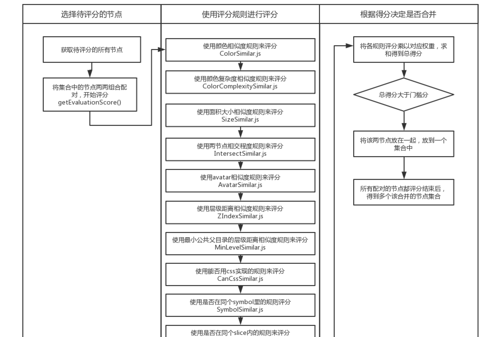

# 合图逻辑
## 概述
合图逻辑模块是将两节点通过评分规则进行评分，若得分大于门槛分，则认为两节点该合并在一起。

## 算法思想


- <strong>节点相交相似度的规则</strong> 计算两节点的相交面积，面积越大得分越高；若两节点相离，则计算最接近的两个端点形成的面积，面积越大得分越低。规则里可添加阈值，扩大节点范围，使相离较近的节点也认为是相交，能得到较高分数。
- <strong>面积大小相似度的规则</strong> 计算两节点的面积比（小除以大），越接近1得分越高。
- <strong>avatar相似度规则</strong> 比较两个节点是否都是同一种形状（正方形/圆形），是否图形中心在同一水平线，面积是否小于某个值（用于处理紧挨的头像不做处理、紧挨的信号圆点应该合在一起），若为是则得分高。
- <strong>层级距离相似度的规则</strong> 计算两节点在层级上的距离，距离越小得分越高。逻辑是更里层的节点走到一起所需要的步数。为了和同层的距离做出差别，当需要向外层走时，需要付出更大的代价（2的层数次方步）
- <strong>最小公共父目录层级相似度的规则</strong> 计算两节点的最小公共父目录的层级，层级相差越小得分越高。
- <strong>是否在同个slice的规则</strong> 若节点都在同一个slice的区域内，则得分高。
- <strong>AI认为是否该合并的规则</strong> 若节点都在AI认为该合成的同一个区域内，则得分高。
- <strong>是否在同个symbol的规则</strong> 若节点都在同一个symbol里，则得分高。
- <strong>是否能用css实现的规则</strong> 若节点能用css实现，则不该合并。
- <strong>颜色相似度规则</strong> 比较两个节点的颜色属性，根据各自的r、g、b的方差求和决定颜色的差别，差值越小越相似得分越高。若节点颜色是渐变色，则取算数平均值。若节点是图片、无颜色属性则不用该规则，改为用颜色复杂相似度的规则。
- <strong>颜色复杂相似度的规则</strong> 颜色复杂度的意思是节点包含的颜色丰富度，例如图标一般是单色纯色，一些图片是渐变色或者颜色丰富复杂。若两节点的颜色复杂度相似，则得分高

## 调用方式
### 1. 引用
```typescript
let RulesEvaluation = require('../rules/RulesEvaluation');
```
### 2. 创建对象与初始化
```typescript
/**
 * 初始化
 * @param {Object} ruleParamObj 
 * ruleParamObj.XXXXXSimilar : 某个评分规则的入参，内含weight属性，表示该规则的权重
 * ruleParamObj.sliceArr : slice区域数组
 * ruleParamObj.aiArr : AI认为该合并的区域数组
 */
var eva = new RulesEvaluation(ruleParamObj);
```
### 3.获取两节点的得分
```typescript
eva.getEvaluationScore(nodeA,nodeB);
```

## 数据结构说明

### ruleParamObj

描述：ruleParamObj是初始化的入参，内可包含各评分规则的入参、slice区域数组、AI认为该合并的区域数组

#### 属性
| 名字 | 类型 | 描述 |
| ------ | ------ | ------ |
| XXXXXSimilar | `Object` | 某规则入参 |
| sliceArr | `Array<Object>` | slice区域数组 |
| aiArr | `Array<Object>` | AI认为该合并的区域数组 |

### XXXXXSimilar

描述：某规则入参对象，有ColorSimilar、SizeSimilar、IntersectSimilar、ZIndexSimilar、MinLevelSimilar、ColorComplexitySimilar、SymbolSimilar、AvatarSimilar、SliceSimilar、AiSimilar、CanCssSimilar

#### 属性
| 名字 | 类型 | 描述 |
| ------ | ------ | ------ |
| weight | `Float` | 该规则权重 |

### sliceArr

描述：slice区域数组

#### 单个数组元素属性
| 名字 | 类型 | 描述 |
| ------ | ------ | ------ |
| abX | `Number` | 区域绝对坐标X |
| abY | `Number` | 区域绝对坐标Y |
| width | `Number` | 区域宽度 |
| height | `Number` | 区域高度 |

### aiArr

描述：AI认为该合并的区域数组

#### 单个数组元素属性
| 名字 | 类型 | 描述 |
| ------ | ------ | ------ |
| id | `Number` | 标识 |
| det | `Number` | 识别类型 |
| name | `Number` | 识别内容，固定为probability |
| rate | `Float` | 准确率 |
| abX | `Number` | 区域绝对坐标X |
| abY | `Number` | 区域绝对坐标Y |
| width | `Number` | 区域宽度 |
| height | `Number` | 区域高度 |

#### 方法
| 名字 | 参数 | 返回 | 描述 |
| ------ | ------ | ------ | ------ |
| getEvaluationScore(nodeA,nodeB) | nodeA: `QObject` nodeB: `QObject` | `Float` | 获取两节点的得分 |
| canUseColorSimilar(nodeA,nodeB) | nodeA: `QObject` nodeB: `QObject` | `Boolean` | 检查两个节点是否能用颜色相似度规则，当两个节点都存在颜色数据才能使用颜色相似度规则 |
| setWeight(ruleParamObj) | ruleParamObj: `Object` | `Void` | 设置规则的权重 |
| translateWeight(ruleParamObj) | ruleParamObj: `Object` | `Void` | 将各规则设置的0~100的权重转换为占总权重的百分比 |


