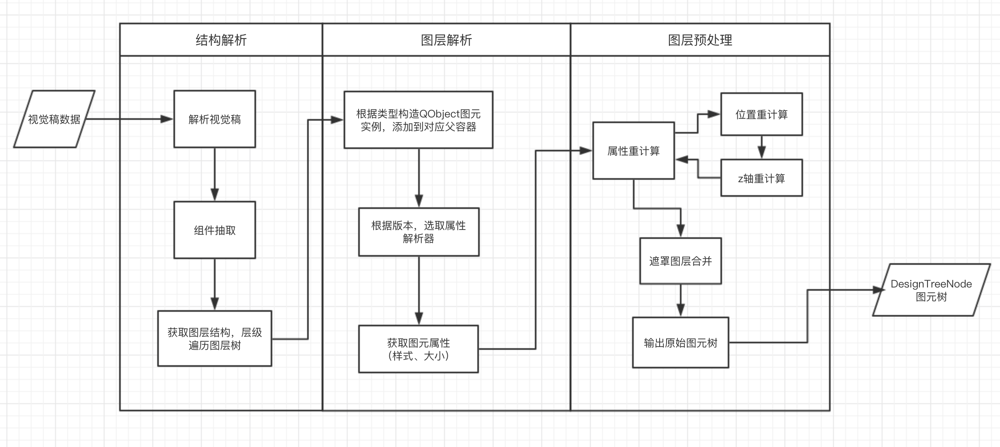

# DesignJson
## 概述
DesignJson模块主要是对视觉稿图层进行抽象和预处理，输出图元优化树，供DSL模块和绘图模块调用。

DesignJson模块分为parser和optimize子模块，其中parser模块主要将视觉稿解析为图元树，optimize模块则对图元树进行清洗优化。
## 术语
- <strong>图层</strong> 视觉稿节点
- <strong>图元</strong> 单个图层的抽象类[QObject](#qobject)
- <strong>图元树</strong> 具有树形结构的图元根节点，是对视觉稿单个页面实例的抽象

## 调用方式
### 1. 引用
```typescript
const Parser = require("server_modules/designjson/parser");
const Optimize = require("server_modules/designjson/optimize");
```
### 2. sketch原数据处理与属性转换
```typescript
const Sketch_Map = require('./sketch_map.js');
//获取sketch版本对应的属性样式解析器
let sketchParser = Sketch_Map.init_sketch(version);
//解析layer的所有属性、样式
styles = sketchParser.getStyle(layer);
```

### 3. 解析与优化
```typescript
// 针对sketch视觉稿数据抽象
let SketchParser = Parser['sketch'];
SketchParser.init( currentPagesJsonsArr, currentDocumentJson, appVersion );
// 对sketch的artboard进行解析
let { document: designTreeNode } = SketchParser.parse( artBoardId );
// 优化图元树
Optimize(designTreeNode); 
```
### 4.图元数据输出
```typescript
// 输出图元集合，供DSL模块使用
let designNodes = currentDesignDom.toList();
// 输出图片图元数据集，供designImage绘图使用
let designImages = currentDesignDom.getImage();
```

## Parser模块
### 概述
Parser模块承担数据抽象任务，将平台输入的视觉稿图层抽象为图元。针对不同的视觉稿如Sketch,Photoshop类型，Parser提供了对应的解析器进行抽象，抽象过程具体可分为三步：1. 结构解析; 2. 图层解析; 3. 图层预处理。


### sketch数据处理
对原始的sketch文件进行处理，获取我们所需要的数据。每个layer被处理之后都返回
borderRadius,border,opacity,rotation,shadows,background
### 结构解析
获取视觉稿图层结构，遍历图层。

### 图层解析
识别图层类型，创建图元`QShape`,`QImage`,`QText`,`QLayer`，将样式赋值到图元上，并添加到父图元的children列表。

### 图层预处理
将图层缺失属性进行重计算，获得统一图元属性。

## Optimize模块
### 概述
Optimize模块承担数据优化任务，包括垃圾图元清洗、图元结构重组、图元转换等。

### 图元清洗
图元清洗主要任务是识别并移除图元树中的不可见图元，减少冗余和垃圾图元对布局的影响。
- 算法思想：遍历图元树，通过规则识别图元是否被覆盖，是否全透明，是否空样式，满足其一则移除该图元。

### 结构重组
结构重组主要是通过算法，对图元树结构进行层级优化，这一步是降低图元优化复杂度的重要步骤。
- 算法思想：深度遍历图元树，针对当前图元，找到所有包含关系，选出能包含该图元的最小父容器；如果最小父容器与原始图元父容器不同，则更新父子关系。

### 图元转换
图元转换是通过规则改变图元类型，包括多个零散图元合并，复杂图形文字转换。
- 算法思想：图元的转换遵循同级处理，向上递归原则。

## 数据结构说明

### QObject

描述：QObject是描述图层的抽象类，根据图层类型可分为`QShape`,`QImage`,`QText`,`QLayer`

#### 属性
| 名字 | 类型 | 描述 |
| ------ | ------ | ------ |
| id | String | 图元id |
| name | String | 图元名称 |
| type | String | 图元类型 |
| abX | Number | 图元水平绝对坐标X |
| abY | Number | 图元垂直绝对坐标Y |
| width | Number | 图元宽度 |
| height | Number | 图元高度 |
| parent | QObject | 图元父节点 |
| children | Array\<QObject> | 图元子节点数组 |
| styles | Object | 图元样式 |

#### 方法

| 名字 | 参数 | 返回 | 描述 |
| ------ | ------ | ------ | ------ |
| add(node) | node: `QObject` | `void` | 添加子节点
| remove(node) | node: `QObject` | `void` | 删除子节点 |
| getNodeById(id) | id: `String` | `QObject `| 通过id获取图元 |
| getNodeByName(name) | name: `String` | `QObject` | 通过name获取图元 |
| toList() | 无 | `Array<QObject>` | 获取图元集合 |
| getImage() | 无 | `Array<QObject>` | 获取图片图元集合 |

### QObject.styles

描述：图元样式
#### 属性
| 名字 | 类型 | 描述 |
| ------ | ------ | ------ |
| background | Object | 图元背景 |
| border | Object | 图元边框 |
| borderRadius | Array | 图元圆角 |
| shadow | Array | 图元阴影 |
| opacity | Number | 图元透明度 |

## QText
描述：文本图元
#### 属性
| 名字 | 类型 | 描述 |
| ------ | ------ | ------ |
| text | String | 文本内容 |

### QText.styles
描述：文本图元样式
#### 属性
| 名字 | 类型 | 描述 |
| ------ | ------ | ------ |
| texts | Array | 文本样式 |

#### QText.styles.texts

#### 属性
| 名字 | 类型 | 描述 |
| ------ | ------ | ------ |
| color | Object | 文字颜色 |
| string | String | 文字内容 |
| font | String | 字体 |
| size | Number | 文字大小 |

## QImage
描述：图片图元
#### 属性
| 名字 | 类型 | 描述 |
| ------ | ------ | ------ |
| path | String | 图片名字 |

## QShape
描述：图形图元，对矩形、圆形、路径等图形图层进行抽象。
#### 属性
| 名字 | 类型 | 描述 |
| ------ | ------ | ------ |
| shapeType | String | 形状类型 |

